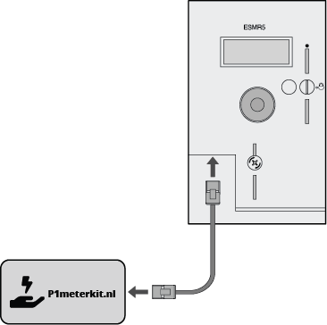

# Installation Guide

## Unboxing

Unbox the P1MeterKit package and identify all the components. You should have the following items:
- P1MeterKit
- RJ12 cable

Optional (if selected at checkout page):
- USB-A to USB-C cable (3 meters)
- Power adapter (European)

## Step 1: Connect to Energy Meter

Begin by connecting the P1MeterKit to your energy meter using the provided RJ12 cable. If your meter supports powering devices through this connection, the P1MeterKit will automatically power up. If your meter does not support powering through the RJ12 connection, you will need to connect a USB-C cable with a power adapter to the P1MeterKit to supply power.

## Step 2: Power by Cable (Optional)

When used with a DSMR v5 meter, the P1MeterKit typically receives power directly through the provided RJ12 cable from the energy meter. If your energy meter does not support this feature, or if you are using a DSMR v4 meter, you will need to connect a USB-C cable with a power adapter to the P1MeterKit to supply power.

## Step 3: LED Information

Verify the LEDs that are currently on, then continue to Step 4. Note: If the kit flashes the LEDs rapidly on and off when powered only from the RJ12 cable, your energy meter does not provide enough power. Connect a USB-C cable as explained in Step 2. Either LED 1 should be solid on or LED 2; LED 3 should flash red. Then proceed to Step 4.

- **LED 1 (White Light)**: Turns on when the kit is powered via a USB-C connection.
- **LED 3 (Yellow Light)**: Turns on when the kit is powered through the RJ12 cable connected to the energy meter.
- **LED 2 (Red Light)**: Flashes if the kit is not connected to Home Assistant or your Wi-Fi network. Proceed to Step 4.

## Step 4: Connect to WiFi

Upon starting up the kit, the P1MeterKit emits a WiFi hotspot named 'p1meterkit' with the password 'p1meterkit'. Connect to this hotspot and a pop-up window will appear where you can select your own WiFi network. Ensure your WiFi network is a 2.4 GHz network. If the fallback hotspot does not appear, try using a different device. It may take up to one minute for the WiFi to become visible after powering on the device.

Note: When you connect to the fallback network, the web interface should open automatically. If that does not work, navigate to [http://192.168.4.1/](http://192.168.4.1/) manually in your browser.

## Step 5: Connect to Home Assistant

Open Home Assistant and navigate to **Settings -> Devices & Services**. Home Assistant will automatically detect the P1MeterKit under the 'Devices & Services' section. If this does not happen, you need to add the device manually. Look up the IP address of the P1MeterKit in your router, then go to **Home Assistant settings -> Devices & Services**. Click on **Add Integration**, select **ESPHome**, and enter the IP address of the device. It will then be added.

After connecting to Home Assistant, your device will be visible under **Home Assistant -> Settings -> Devices & Services**. Look for the ESPHome integration and click on it to see your P1MeterKit with all its entities.

For detailed instructions on integrating the P1MeterKit with the HA Energy Dashboard or DSMR-Reader, please continue to the [usage guide](usage.md).